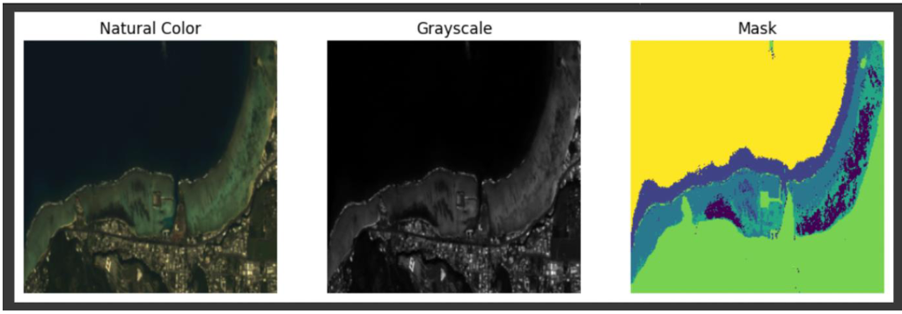

# Multispectral Coastal Habitat Segmentation

[](https://pytorch.org/)
[](https://python.org/)
[](LICENSE)

Semantic segmentation of coastal habitats from **8-band multispectral GeoTIFF imagery** into **7 habitat classes** using **DeepLabV3-ResNet50** with modified input layer for multispectral data.

---

## Results

### Model Performance

| Metric | Value |
|--------|-------|
| **Training Accuracy** | ~85% |
| **Validation Accuracy** | ~76% |
| **Training Loss** | 2.0 → 0.6 (50 epochs) |

### Full Coastline Habitat Map

<p align="center">
  
</p>

*Improved labeled habitat map — full coastline segmentation showing all 7 habitat classes across multiple tiles*

---

## Overview

This project implements a deep learning pipeline for pixel-wise classification of coastal satellite imagery, addressing challenges like:

- **Multispectral input** — 8 channels instead of standard RGB
- **Class imbalance** — Median-frequency balancing to boost rare classes
- **Limited data** — Data augmentation (flip, rotate, scale, color jitter)
- **Noisy predictions** — Median filtering post-processing

---

## Model Architecture

**DeepLabV3-ResNet50** adapted for multispectral input:

```
Input (8-band GeoTIFF, 256×256)
         │
         ▼
┌─────────────────────────────────┐
│  Modified Conv1 (8→64 channels) │  ← Pretrained RGB weights + extended
└────────────────┬────────────────┘
                 │
                 ▼
┌─────────────────────────────────┐
│     ResNet-50 Backbone          │  ← ImageNet pretrained
│     (Layer 1-4)                 │
└────────────────┬────────────────┘
                 │
                 ▼
┌─────────────────────────────────┐
│  ASPP (Atrous Spatial Pyramid   │  ← Multi-scale context
│        Pooling)                 │
└────────────────┬────────────────┘
                 │
                 ▼
┌─────────────────────────────────┐
│  Decoder + Classifier           │  ← 7-class output
└────────────────┬────────────────┘
                 │
                 ▼
Output (7-class segmentation mask, 256×256)
```

**Key Modification:** The first convolutional layer is expanded from 3→8 input channels. RGB weights are preserved, and additional channels are initialized with the mean of RGB filters.

---

## Habitat Classes

| ID | Class | Color | Description |
|----|-------|-------|-------------|
| 0 | Background | Dark Gray | Non-habitat areas |
| 1 | Seagrass | Dark Green | Submerged aquatic vegetation |
| 2 | Coral | Brown-Red | Coral reef structures |
| 3 | Macroalgae | Olive Green | Macro algae coverage |
| 4 | Sand | Tan | Sandy substrate |
| 5 | Land | Orange-Brown | Terrestrial areas |
| 6 | Ocean | Light Blue | Deep water regions |

---

## Quick Start

### 1. Environment Setup

```bash
# Using conda (recommended)
conda env create -f environment.yml
conda activate habitat-seg

# Or using pip
pip install -r requirements.txt
```

### 2. Data Preparation

```
data/
└── raw_labeled_data/
    ├── images/        # 8-band GeoTIFF tiles (.tif)
    └── annotations/   # Label masks (.tif)
```

### 3. Training

```bash
python train.py \
    --data_dir data/raw_labeled_data \
    --epochs 50 \
    --batch_size 16 \
    --lr 1e-4 \
    --use_class_weights \
    --augment
```

**With TensorBoard logging:**
```bash
python train.py --data_dir data/raw_labeled_data --tensorboard
tensorboard --logdir runs/
```

### 4. Evaluation

```bash
python evaluate.py \
    --checkpoint checkpoints/best.pt \
    --data_dir data/raw_labeled_data \
    --output results/metrics.json
```

### 5. Visualization

```bash
python visualize.py \
    --checkpoint checkpoints/best.pt \
    --data_dir data/raw_labeled_data \
    --num_samples 5
```

### 6. Inference

```bash
python infer.py \
    --checkpoint checkpoints/best.pt \
    --image_dir data/test_images \
    --out_dir outputs
```

---

## Training Features

| Feature | Description |
|---------|-------------|
| **Class Weighting** | Median-frequency balancing for imbalanced classes |
| **Data Augmentation** | Random flip, rotation, scaling, brightness/contrast |
| **LR Scheduler** | Cosine annealing with warm restarts |
| **Early Stopping** | Patience-based stopping on validation mIoU |
| **TensorBoard** | Training curves, sample predictions |
| **Checkpointing** | Best model (by mIoU) + last epoch |

---

## Evaluation Metrics

| Metric | Description |
|--------|-------------|
| **mIoU** | Mean Intersection over Union (primary metric) |
| **Pixel Accuracy** | Overall pixel classification accuracy |
| **Per-class IoU** | IoU for each habitat class |
| **Macro F1** | Macro-averaged F1 score |
| **Confusion Matrix** | Full 7×7 confusion matrix |

---

## Repository Structure

```
├── src/
│   ├── __init__.py         # Package exports
│   ├── model.py            # DeepLabV3 architecture
│   ├── dataset.py          # GeoTIFF data loading
│   ├── metrics.py          # mIoU, F1, confusion matrix
│   ├── augmentations.py    # Data augmentation transforms
│   └── utils.py            # Utility functions
├── train.py                # Training script
├── evaluate.py             # Evaluation script
├── visualize.py            # Visualization script
├── infer.py                # Inference script
├── assets/                 # Result visualizations
├── notebooks/              # Exploration notebooks
├── report/                 # Project report (PDF)
├── environment.yml         # Conda environment
└── requirements.txt        # Pip requirements
```

---

## Techniques

### Handling Multispectral Input

Standard pretrained models expect 3-channel RGB input. We modify the first conv layer:

```python
# Preserve pretrained RGB weights
new_conv.weight[:, :3] = old_conv.weight

# Initialize extra channels with mean of RGB filters
mean_w = old_conv.weight.mean(dim=1, keepdim=True)
new_conv.weight[:, 3:] = mean_w.repeat(1, in_channels - 3, 1, 1)
```

### Class Imbalance

Coastal imagery has highly skewed class distributions. Simple inverse-frequency weights under-penalize rare classes like Ocean. We use **median-frequency balancing**:

```python
freqs = counts / counts.sum()
median_freq = torch.median(freqs[freqs > 0])
weights = median_freq / (freqs + 1e-8)
criterion = nn.CrossEntropyLoss(weight=weights)
```

### Data Augmentation

Training augmentations applied jointly to image and mask:
- Horizontal/vertical flip (p=0.5)
- Random rotation (±15°)
- Random scale (0.8× - 1.2×)
- Brightness/contrast jitter (±20%)

### Post-Processing

Median filtering applied to predictions to reduce salt-and-pepper noise:

```python
from scipy.ndimage import median_filter
smoothed_pred = median_filter(prediction, size=3)
```

---

## Documentation

- [`report/PROJECT-3_REPORT.pdf`](report/PROJECT-3_REPORT.pdf) — Full technical report with methodology and results

---

## Citation

If you use this code, please cite:

```bibtex
@misc{reddy2025habitat,
  author = {Reddy, Rajeev},
  title = {Multispectral Coastal Habitat Segmentation},
  year = {2025},
  publisher = {GitHub},
  url = {https://github.com/redddddyyyyy/multispectral-habitat-segmentation}
}
```

---

## License

MIT
